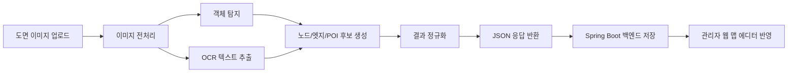

# Insideout AI Service

실내 도면 이미지를 AI로 분석하여 노드, 엣지, POI 후보를 추출하는 FastAPI 서버입니다.
백엔드(Spring Boot)로부터 분석 요청을 받아 결과를 JSON으로 반환합니다.

---
## 👥 팀원 소개 (Contributors)

> **Insideout 프로젝트를 이끈 양양양말을 소개합니다.**

| **차승은** | **이민지** | **김민준** | **김세현** |
| :---: | :---: | :---: | :---: |
| [ ](https://github.com/cktmddms) | [ ](https://github.com/thisminji) | [ ](https://github.com/minjune0) | [ ](https://github.com/sekong11) |
| 🔹 **Hybrid Navigation**   사용자 웹 - BE, FE | 🔹 **Auth, Search, Infra**   사용자 웹 - BE, FE | 🔹 **AI Map Builder**   관리자 웹 - AI, FE | 🔹 **Map Editor**   관리자 웹 - BE, FE |

---

## 🛠 기술 스택

### Core

  
  
  

### AI / CV

  
  
  

### Validation

  

## 🤖 AI 서비스 핵심 역할 (Core Responsibilities)
### 1. 실내 도면 이미지 분석
실내 도면 이미지를 입력받아 벽, 공간, 출입구, 상점명 등 주요 객체를 자동으로 인식합니다.
도면의 해상도와 표기 방식이 달라도 최대한 일관된 분석 결과를 얻을 수 있도록 전처리와 후처리 과정을 함께 적용했습니다.
- 도면 이미지 전처리
- 객체 탐지 및 구조물 추출
- 텍스트 OCR 인식
- 분석 결과 JSON 반환
---
### 2. 노드, 엣지, POI 후보 추출
AI 분석 결과를 기반으로 관리자 웹에서 사용할 수 있는 길찾기 후보 데이터를 생성합니다.
단순 이미지 인식이 아니라, 실제 실내 경로 그래프 구축에 필요한 구조로 데이터를 정리합니다.

- POI 후보 추출
- 노드 후보 추출
- 엣지 후보 추출
- 관리자 편집용 초안 데이터 생성
---
### 3. 관리자 웹 초기 데이터 공급
AI가 만든 초안은 그대로 운영 데이터로 쓰지 않고, 백엔드와 관리자 웹의 맵 에디터가 활용할 수 있도록 전달됩니다.
관리자는 이 결과를 검토하고 수정한 뒤 최종 배포할 수 있습니다.

- Draft 초기화용 데이터 제공
- 맵 에디터 연동용 응답 포맷 통일
- 텍스트, 오브젝트, POI, 노드/엣지 결과 분리 반환
---
### 4. 캠퍼스 및 건물 도면 분석
실내 도면뿐 아니라 단지 또는 캠퍼스 형태의 이미지 분석도 지원하여, 건물 단위와 캠퍼스 단위의 초기 맵 구축을 보조합니다.
- 건물 도면 분석
- 캠퍼스 지도 분석
- 분석 타입별 결과 분기 처리
---
## 🔄 AI 분석 흐름 (Data Flow)

## 📌 주요 API 명세 요약
### Floorplan Analysis API
| Method |	Endpoint	| Description |
| :---: | :---: | :---: | 
| POST |	/api/v1/ai/floorplans/{floorplanId}/analyze	| 실내 도면 AI 분석 요청 |
| GET	| /api/v1/ai/floorplans/{floorplanId}/detections	| 실내 도면 분석 결과 조회 |

### Campus Analysis API
| Method	| Endpoint	| Description |
| :---: | :---: | :---: |
|POST	 | /api/v1/ai/campuses/{campusMapId}/analyze	| 캠퍼스 지도 AI 분석 요청 |
| GET	| /api/v1/ai/campuses/{campusMapId}/detections	| 캠퍼스 지도 분석 결과 조회 |

---

## 🔥 기술적 도전 및 해결 과제 (Technical Challenges)
### 1. 도면 품질 차이로 인한 분석 결과 불안정성
* **문제**: 도면마다 해상도, 축척, 표기 방식이 달라 동일한 모델을 적용해도 결과가 일관되지 않았습니다.
* **해결**: 전처리 단계에서 이미지 특성을 보정하고, 후처리 단계에서 결과를 정규화하여 관리자 웹에서 활용 가능한 형태로 변환했습니다.
---
### 2. 텍스트와 구조물 정보를 함께 다뤄야 하는 문제
* **문제**: 실내 지도는 단순 객체 탐지뿐 아니라 매장명, 층수, 출입구 표시 같은 텍스트 정보도 중요합니다.
* **해결**: OCR 결과와 객체 탐지 결과를 분리해서 수집한 뒤, 하나의 JSON 구조로 합쳐 맵 에디터 초기 데이터로 사용할 수 있게 했습니다.
---
### 3. AI 결과를 운영 데이터로 바로 쓰기 어려운 문제
* **문제**: 탐지 결과에는 오탐이나 누락이 존재할 수 있어 그대로 서비스에 반영하면 경로 오류가 발생할 수 있습니다.
* **해결**: AI 결과를 초안 데이터로만 사용하고, 관리자 웹에서 검토 및 수정 후 배포하는 구조로 설계했습니다.
### 4. 백엔드와의 응답 구조 정합성 유지
* **문제**: AI 서버가 다양한 분석 타입을 반환하더라도 백엔드가 일관되게 처리할 수 있어야 했습니다.
* **해결**: Pydantic 기반 응답 모델을 사용해 타입별 결과 형식을 통일하고, 백엔드가 안정적으로 저장할 수 있도록 했습니다.
